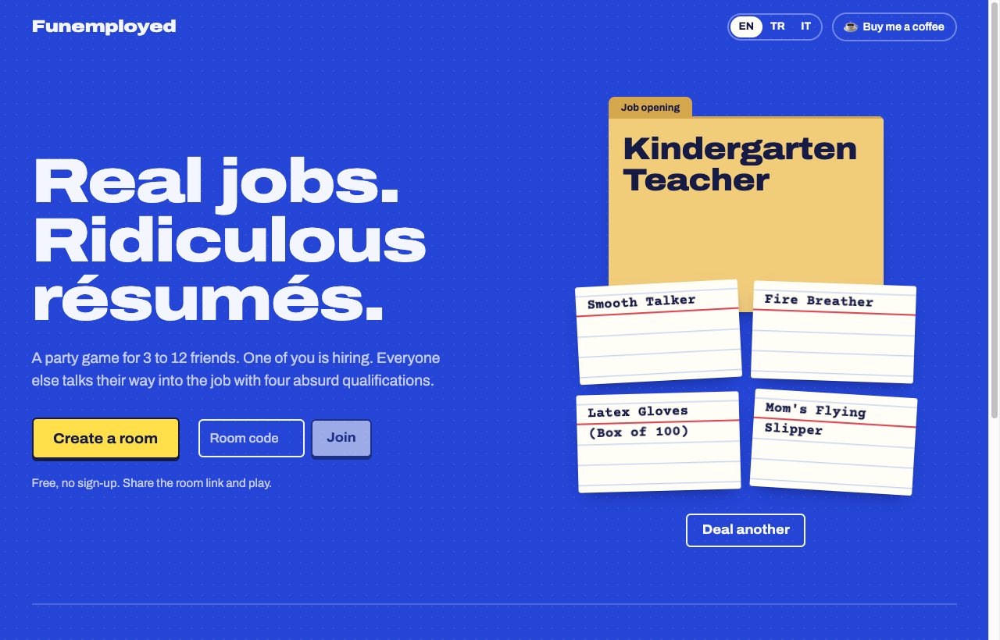
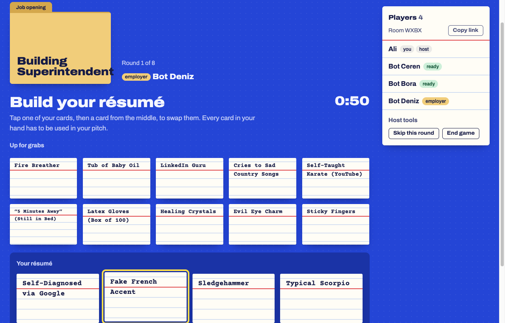
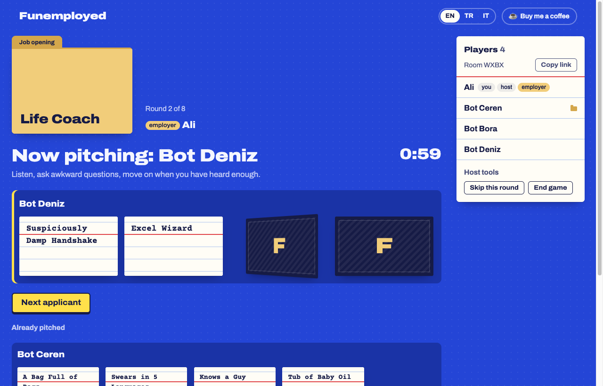
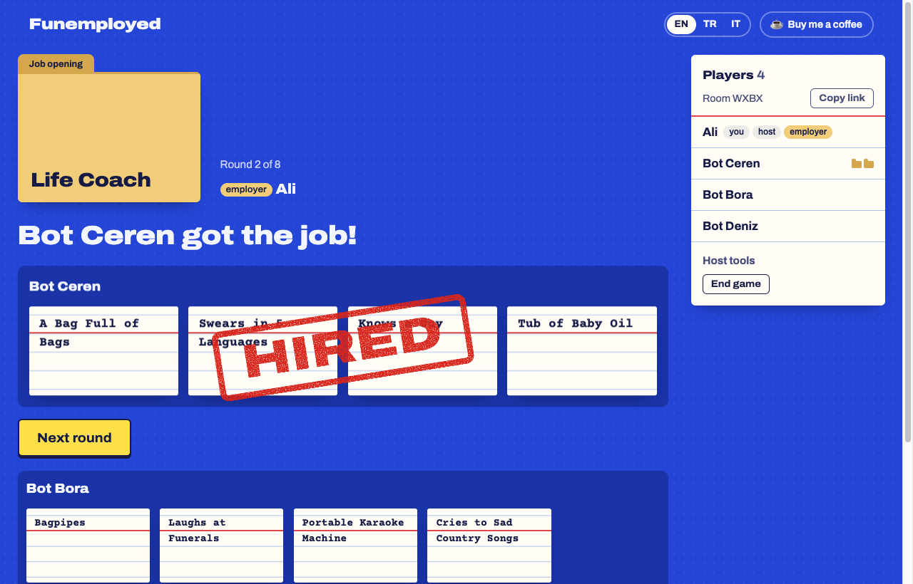

<div align="center">

# Funemployed

**Real jobs. Ridiculous résumés.**

A free online party game for 3 to 12 friends. One player is hiring.<br>
Everyone else talks their way into the job with four absurd qualifications.

No sign-up · English · Türkçe · Italiano

<a href="https://buymeacoffee.com/armanalis"></a>



</div>

## How to play

1. **Open a room.** Someone creates a room and shares the link. Everyone else types a name and joins. No accounts.
2. **Read the job opening.** Each round, one player is the employer and turns over a job, like *Hostage Negotiator* or *Mall Santa*.
3. **Build your résumé.** Every applicant gets four qualification cards and has a minute to swap them with the cards in the middle.
4. **Pitch.** Applicants take turns revealing their cards one at a time and explaining why *Emotional Support Chicken* makes them perfect for the job. Every card has to be used.
5. **Hire.** The employer picks the best pitch and the winner keeps the job card. Can't decide? Call a **tiebreaker**: each finalist gets two extra cards and uses one for a final argument.
6. **Vote.** Everyone else votes for the funniest pitch. The fan favorite earns a star.

Each job and each star is a point. Whoever has the most points at the end is Employee of the Month.

Play in the same room or over a video call: the site deals the cards, you do the talking.

| Build your résumé | Pitch | Get hired |
|---|---|---|
|  |  |  |

## Features

**Play**
- **Rooms with a 4-letter code.** Share `yoursite.com/ABCD` and friends land straight in the lobby.
- **Three languages, per player.** Each person picks EN, TR or IT; the cards switch language on their screen only, so mixed groups can play together.
- **106 jobs and 325 qualifications**, from *Professional Line Stander* to *Emotional Support Chicken*.
- **Drop-in, drop-out.** Refresh or lose Wi-Fi and you rejoin your seat. Late joiners get their turn as employer. If the host leaves, the next player takes over.

**Rules**
- **From the original game:** 10 open cards in the middle, everyone hires twice (once with 7+ players), the tiebreaker, and an optional final round where applicants compete for the employer's *real* job.
- **Audience vote:** a fan-favorite star each round (4+ players).
- **Timers that keep the game moving:** résumé building and each pitch end on their own when time runs out. Pick 30 to 120 seconds, or turn them off.
- **"Running late" mode:** applicants only see their cards while pitching.

**Make it your group's game**
- **Your own cards.** Anyone in the lobby can add jobs and qualifications for that room: inside jokes, friends' names, office lore.
- **Family mode.** Leaves out the cards marked 18+.
- **Host tools.** Remove players in the lobby, skip a stuck round, or end the game.

## Run it locally

Requires Node.js 20 or newer.

```sh
git clone https://github.com/armanalis/funemployed.git
cd funemployed
npm install
npm start
```

Open http://localhost:3000. Friends on the same Wi-Fi can join at `http://<your-computer-ip>:3000`.

**Testing alone?** Create a room, then fill it with bots that swap cards, pitch and hire on their own:

```sh
npm run bots -- ABCD 3      # room code, number of bots
```

Run the tests with `npm test`.

## Make it yours

| To change | Edit |
|---|---|
| Buy Me a Coffee link | [`public/js/config.js`](public/js/config.js) |
| Job and qualification cards | [`public/shared/cards.json`](public/shared/cards.json) |
| Interface text | [`public/js/i18n.js`](public/js/i18n.js) |
| Game rules | [`server/game.js`](server/game.js) |

### Adding cards

Cards live in one JSON file with a text for every language. Mark innuendo with `"adult": true` so family mode leaves it out:

```json
{ "id": 326, "tr": "Evcil Ejderha", "en": "Pet Dragon", "it": "Drago Domestico" }
```

Add new cards at the end of the list. A card's position is its id during a game, so reordering the list mid-game would mix up cards in open rooms. `npm test` fails if a card is missing a language.

### Adding a language

1. Add the language code to `LANGS` in `server/game.js` and `public/js/i18n.js`.
2. Copy the `en` block in `i18n.js` and translate it.
3. Add the new key to every card in `cards.json`.

## How it works

```
server/index.js    Express serves the site; Socket.IO carries every game action
server/game.js     The rules: one Room object per game, kept in memory
public/            The browser app (Preact + htm, no build step)
public/shared/     cards.json, read by both the server and the browser
scripts/bots.js    Bot players for testing
```

The server is the only source of truth. Each player receives a view of the game with other players' hands hidden, so nobody can peek at cards through the browser's dev tools.

There is no database. Cards ship with the code; rooms, including the cards players add, live in server memory for 30 minutes after the last player leaves. A server restart ends open games.

## Deploying

The game needs one long-running Node.js process, because rooms live in memory and players stay connected over WebSockets. Hosts like Render, Railway or Fly.io work as-is: set the start command to `npm start`; the server reads the `PORT` environment variable. Run a single instance, since rooms aren't shared between servers.

## License

Code released under the [MIT License](LICENSE).

This is an unofficial fan project. It is not affiliated with or endorsed by the publishers of the Funemployed card game.
